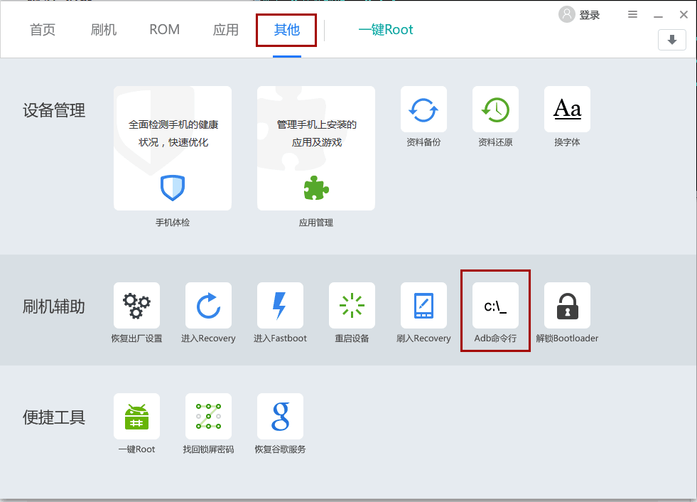
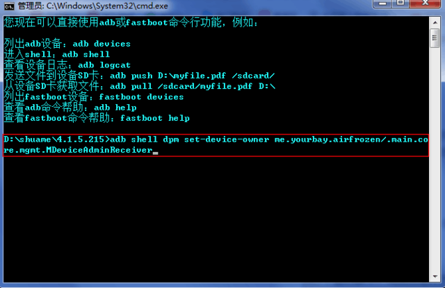

## 注意

需要安装空调狗1.4或更高版本, [http://t.cn/R5myvvr](http://coolapk.com/apk/me.yourbay.airfrozen)

下面是各种手机【通用】的免ROOT的步骤：

## 操作步骤

#### 【1】 
首先去【系统设置】中开启【开发者模式】并给电脑授权。
通用的是:【系统设置】→【关于手机】→ 疯狂点击【版本号】→ 回到【系统设置】→【开发者选项】→ 选中【Android调试】。
如【成功】用过各种手机助手的话，可略过。各手机可能会出入，可百度或者Google之。

#### 【2】
到【系统设置】→【账户】中 删除【所有的】账户。格删勿论一个不留。

#### 【3】
执行下面的脚本。如果你是开发者的话，可略过脚本，直接在【电脑终端】执行:
`adb shell dpm set-device-owner me.yourbay.airfrozen/.main.core.mgmt.MDeviceAdminReceiver`

脚本的下载地址是：[github.com/hyongbai/AirFrozenGranter/releases](https://github.com/hyongbai/AirFrozenGranter/releases) 如不能访问，请使用[【刷机精灵】](http://www.shuame.com/)(等类似电脑软件)安装驱动，进入【刷机精灵】→ 【其他】→ 【Adb命令行】执行如上的命令。截图如下:

#### 【4】
如果提示`Success`或者`device owner is already set`之类的话，即表示成功。

如果提示`Not allowed to set the device owner because there are already several users on the device`的话，则表示手机上面有多个【用户】，请去【设置】→【用户】删除其他用户。如果仍然不行，则只能FactoryReset了。

## 运行脚本

### Linux/Mac

运行脚本(双击)即可。方法如下:

	free4airfrozen.sh

如不成功请参考如上的命令。

### Windows

暂时无Windows电脑版本。请进入电脑终端/命令行执行【步骤3】中的命令。 

## 最后

祝大家搞机愉快。阖家欢乐，万事如意，🐔年大吉吧。
